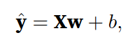
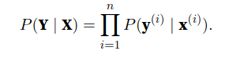
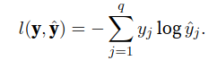

# 1. Linear Neural Networks

## 1.1 Linear regression
Regression refers to a set of methods for modeling the relationship between one or more independent variables and a dependent variable.

**Assumptions:**
* the relationship between the independent variables x and the dependent variable y is linear.
* any noise is well-behaved (following a Gaussian distribution).

### 1.1.1 Linear model:
Strictly speaking, is an affine transformation of input features, which is characterized by a linear transformation of features via weighted sum, combined with a translation via the added bias.

**Dim:**
- y [n x 1]
- X [n x D]
- w [D x 1]
- b [1 x 1]

### 1.1.2 Loss function
The loss function quantifies the distance between the real and predicted value of the target.The loss will usually be a non-negative number where smaller values are better and perfect predictions incur a loss of 0. The most popular loss function in regression problems is the squared error.

To measure the quality of a model on the entire dataset of n examples, we simply average (or equivalently, sum) the losses on the training set.

When training the model, we want to find parameters that minimize the total loss.

**Minibatch Stochastic Gradient Descent:**
The key technique for optimizing nearly any deep learning model consists of iteratively reducing the error by updating the parameters in the direction that incrementally lowers the loss function. This algorithm is called *gradient descent*.

In each iteration, we first randomly sample a minibatch **B** consisting of a fixed number of training examples. We then compute the derivative (gradient) of the average loss on the minibatch with regard to the model parameters. Finally, we multiply the gradient by a predetermined positive value and subtract the resulting term from the current parameter values.

# 1.2 Softmax regression
**One-hot encoding:** is a vector with as many components as we have categories. The component corresponding to particular instanceʼs category is set to 1 and all other components are set to 0.

### 1.2.1 Network architecture
In order to estimate the conditional probabilities associated with all the possible classes, we need a model with multiple outputs, one per class.

The main approach that we are going to take here is to interpret the outputs of our model as probabilities. Then, to generate predictions, we will set a threshold, for example, choosing the label with the maximum predicted probabilities.

To transform our logits such that they become non negative and sum to 1, while requiring that the model remains differentiable, we first exponentiate each logit(ensuring non-negativity) and then divide by their sum (ensuring that they sum to 1):

### 1.2.2 Loss function
We can compare the estimates with reality by checking how probable the actual classes are according to our model, given the features:

According to maximum likelihood estimation, we maximize P, which is equivalent to minimizing the negative log-likelihood

where for any pair of label y and model prediction y hat over q classes, the loss functionl is:

