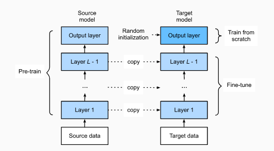

# 10. Image augmentation and fine tuning

## 10.1 Image augmentation

Image augmentation technology expands the scale of training datasets by making a series of random changes to the training images to produce similar, but different, training examples. Another way to explain image augmentation is that randomly changing training examples can reduce a model’s dependence on certain properties, thereby improving its capability for generalization.

* Flipping and Cropping:
  - `torchvision.transforms.RandomHorizontalFlip()`
  - `torchvision.transforms.RandomVerticalFlip()`
  - `torchvision.transforms.RandomResizedCrop()`

* Changing the color:
  - `torchvision.transforms.ColorJitter()`

* Overlying Multiple Image Augmentation Methods:
  - `torchvision.transforms.Compose([transformers list])`

## 10.2 Fine tuning

Migrate the knowledge learned from the source dataset to the target dataset. Models trained on ImageNet can extract more general image features that can help identify edges, textures, shapes, and object composition. Fine tuning consists of the following four steps:

1. Pre-train a neural network model, i.e., the source model, on a source dataset (e.g., the ImageNet dataset).

2. Create a new neural network model, i.e., the target model. This replicates all model designs and their parameters on the source model, except the output layer. We assume that these model parameters contain the knowledge learned from the source dataset and this knowledge will be equally applicable to the target dataset. We also assume that the output layer of the source model is closely related to the labels of the source dataset and is therefore not used in the target model.

3. Add an output layer whose output size is the number of target dataset categories to the target model, and randomly initialize the model parameters of this layer.

4. Train the target model on a target dataset. We will train the output layer from scratch, while the parameters of all remaining layers are fine-tuned based on the parameters of the source model.

