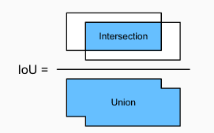
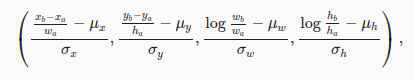
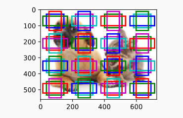
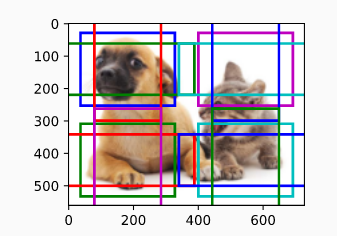
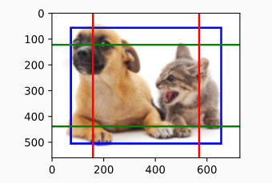
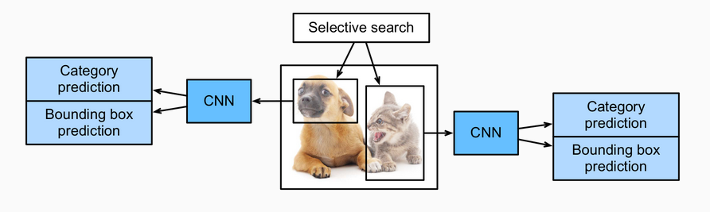
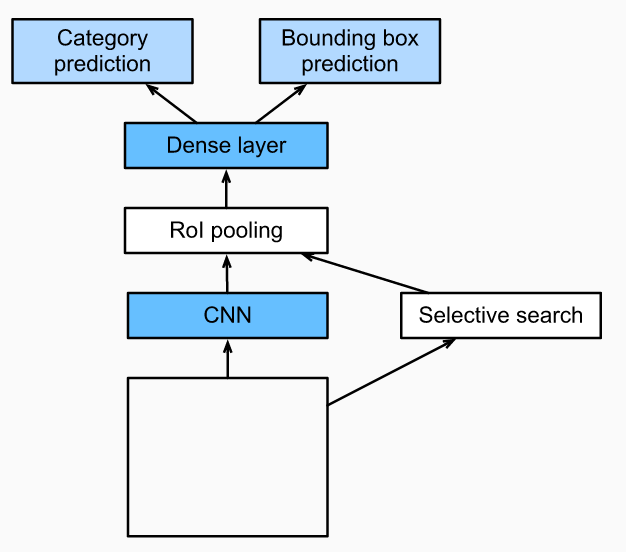
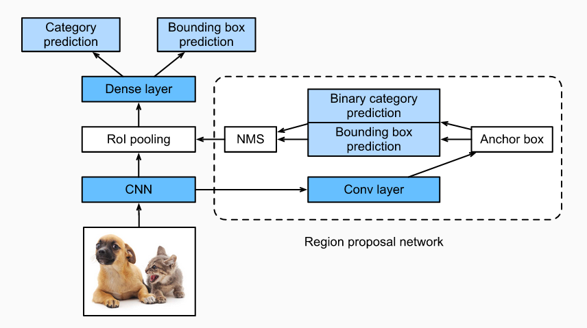

# 11. Object detection

## 11.1 Bounding Boxes
The bounding box is a rectangular box that can be determined by the x and y axis coordinates in the upper-left corner and the x and y axis coordinates in the lower-right corner of the rectangle. Another commonly used bounding box representation is the x and y axis coordinates of the bounding box center, and its width and height.

## 11.2 Anchor Boxes
Anchor boxes are multiple bounding boxes with different sizes and aspect ratios while centering on each pixel.

* Anchor box sizes:
  - wa = w.s.√r
  - ha = h.s/√r

Having a set of sizes Sn and a set of aspect ratios Rm, we are usually only interested in a combination containing s1 or r1 sizes and aspect ratios.

That is, the number of anchor boxes centered on the same pixel is (n + m - 1).

## 11.3 Intersection over Union
To measure how well the anchor box is, we measure the similarity between anchor boxes and the ground-truth bounding box with the Jaccard index.

## 11.4 Labeling Training Set Anchor Boxes
In object detection, we first generate multiple anchor boxes, predict the categories and offsets for each anchor box, adjust the anchor box position according to the predicted offset to obtain the bounding boxes to be used for prediction, and finally filter out the prediction bounding boxes that need to be output.

Define matrix X ∈ Rna×nb, where element xij in the ith row and jth column is the IoU of the anchor box Ai to the ground-truth bounding box Bj. Select the highest xij and discard all elements in the row i and in the column j. Continue for each column j (each ground-trhuth bounding box).

If an anchor box A is assigned ground-truth bounding box B, the category of the anchor box A is set to the category of B. And the offset of the anchor box A is set according to the relative position of the central coordinates of B and A and the relative sizes of the two boxes. Because the positions and sizes of various boxes in the dataset may vary, these relative positions and relative sizes usually require some special transformations to make the offset distribution more uniform and easier to fit (If the IoU = 0.5, the anchor box is discarted).

## 11.5 Multiscale Object Detection
It is not difficult to reduce the number of anchor boxes. An easy way is to apply uniform sampling on a small portion of pixels from the input image and generate anchor boxes centered on the sampled pixels. In addition, we can generate anchor boxes of varied numbers and sizes on multiple scales.

We can divide the feature map and use different sizes:

Since we have generated anchor boxes of different sizes on multiple scales, we will use them to detect objects of various sizes at different scales.

## 11.6 Region-based CNNs

### 11.6.1 R-CNNs

1. Selective search is performed on the input image to select multiple high-quality proposed regions. These proposed regions are generally selected on multiple scales and have different shapes and sizes. The category and ground-truth bounding box of each proposed region is labeled.

2. A pre-trained CNN is selected and placed, in truncated form, before the output layer. It transforms each proposed region into the input dimensions required by the network and uses forward computation to output the features extracted from the proposed regions.

3. The features and labeled category of each proposed region are combined as an example to train multiple support vector machines for object classification. Here, each support vector machine is used to determine whether an example belongs to a certain category.

4. The features and labeled bounding box of each proposed region are combined as an example to train a linear regression model for ground-truth bounding box prediction.

### 11.6.2 Fast R-CNN
Fast R-CNN improves on the R-CNN by only performing CNN forward computation on the image as a whole.

1. Compared to an R-CNN model, a Fast R-CNN model uses the entire image as the CNN input for feature extraction, rather than each proposed region. Moreover, this network is generally trained to update the model parameters. As the input is an entire image, the CNN output shape is 1×c×h1×w1.

2. Assuming selective search generates n
proposed regions, their different shapes indicate regions of interests (RoIs) of different shapes on the CNN output. Features of the same shapes must be extracted from these RoIs (here we assume that the height is h2 and the width is w2). Fast R-CNN introduces RoI pooling, which uses the CNN output and RoIs as input to output a concatenation of the features extracted from each proposed region with the shape n×c×h2×w2

3. A fully connected layer is used to transform the output shape to n×d
, where d is determined by the model design.

4. During category prediction, the shape of the fully connected layer output is again transformed to n×q
and we use softmax regression (q is the number of categories). During bounding box prediction, the shape of the fully connected layer output is again transformed to n×4. This means that we predict the category and bounding box for each proposed region.

### 11.6.3 Faster R-CNN

1. We use a 3×3 convolutional layer with a padding of 1 to transform the CNN output and set the number of output channels to c. This way, each element in the feature map the CNN extracts from the image is a new feature with a length of c.

2. We use each element in the feature map as a center to generate multiple anchor boxes of different sizes and aspect ratios and then label them.

3. We use the features of the elements of length c at the center on the anchor boxes to predict the binary category (object or background) and bounding box for their respective anchor boxes.

4. Then, we use non-maximum suppression to remove similar bounding box results that correspond to category predictions of “object”. Finally, we output the predicted bounding boxes as the proposed regions required by the RoI pooling layer.

