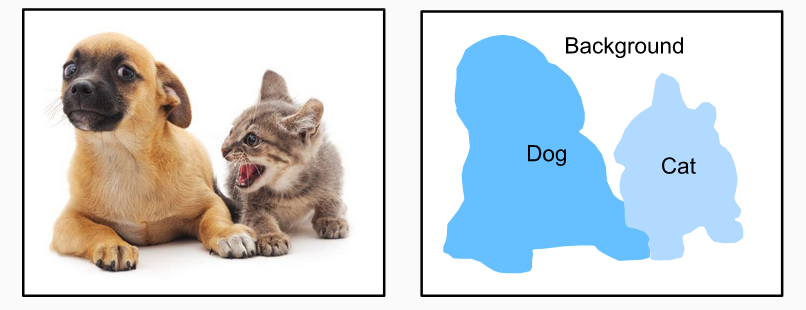
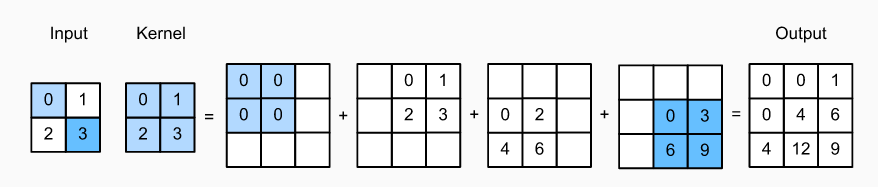
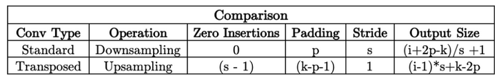
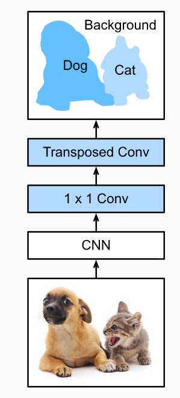
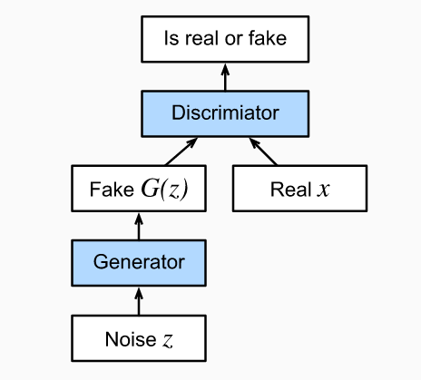
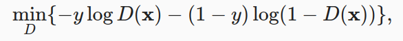
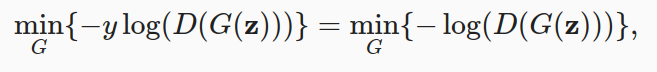

# 12. Semantic Segmentation - GANs

## 12.1 Semantic Segmentation

Attempts to segment images into regions with different semantic categories. These semantic regions label and predict objects at the pixel level.

As you can see, compared to object detection, semantic segmentation labels areas with pixel-level borders, for significantly greater precision.

- **Image segmentation** divides an image into several constituent regions. This method generally uses the correlations between pixels in an image. During training, labels are not needed for image pixels. However, during prediction, this method cannot ensure that the segmented regions have the semantics we want.

- **Instance segmentation** is also called simultaneous detection and segmentation. This method attempts to identify the pixel-level regions of each object instance in an image. In contrast to semantic segmentation, instance segmentation not only distinguishes semantics, but also different object instances. If an image contains two dogs, instance segmentation will distinguish which pixels belong to which dog.

## 12.2 Transposed convolution

Applications such as semantic segmentation and generative adversarial networks, require to predict values for each pixel and therefore needs to increase input width and height. Transposed convolution, also named fractionally-strided convolution or deconvolution, serves this purpose. The transposed convolution broadcasts input values through the kernel, which results in a larger output shape.

## 12.3 Fully Convolutional Networks (FCN)

FCN transforms the height and width of the intermediate layer feature map back to the size of input image through the transposed convolution layer, so that the predictions have a one-to-one correspondence with input image in spatial dimension (height and width).

## 12.4 GANs
At their heart, GANs rely on the idea that a data generator is good if we cannot tell fake data apart from real data.

We need a network that might potentially be able to generate data that looks just like the real thing. We call this the generator network. The second component is the discriminator network. It attempts to distinguish fake and real data from each other. Both networks are in competition with each other. The generator network attempts to fool the discriminator network. At that point, the discriminator network adapts to the new fake data.

- Assume the label y for the true data is 1 and 0 for the fake data. We train the discriminator to minimize the cross-entropy loss, i.e:

 

- For the generator, it first draws some parameter z (latent variable) from a source of randomness. It then applies a function to generate x′ = G(z). The goal of the generator is to fool the discriminator to classify x′ = G(z) as true data, i.e., we want D(G(z)) ≈ 1. In other words, for a given discriminator D, we update the parameters of the generator G to maximize the cross-entropy loss when y = 0, i.e:

 
