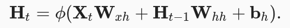
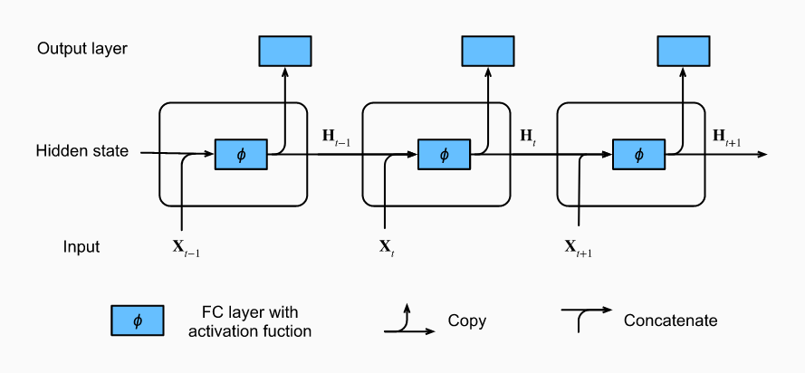
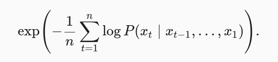

# 13. Recurrent Neural Networks

## 13.1 Sequence Models

Consider some timespan of length τ and only use xt−1,…,xt−τ observations. The immediate benefit is that now the number of arguments is always the same. This models will be called autoregressive models, as they quite literally perform regression on themselves.

The second strategy is to keep some summary ht of the past observations, and at the same time update ht in addition to the prediction x^t. This leads to models that estimate xt with x^t=P(xt∣ht) and moreover updates of the form ht=g(ht−1,xt−1). Since ht is never observed, these models are also called latent autoregressive models.

Recall the approximation that in an autoregressive model we use only xt−1,…,xt−τ instead of xt−1,…,x1 to estimate xt. Whenever this approximation is accurate we say that the sequence satisfies a Markov condition. In particular, if τ=1, we have a first-order Markov model.

## 13.2 Text preprocessing
1. **Tokenization:** A token is the basic unit in text. (The time machine -> [the, time, machine])
2. **Vocabulary:** A dictionary that maps string tokens into numerical indices starting from 0. Any token that does not exist in the corpus or has been removed is mapped into a special unknown token “<unk>”. We add a list of reserved tokens, such as “<pad>” for padding, “<bos>” to present the beginning for a sequence, and “<eos>” for the end of a sequence.

```python
vocab = [('<unk>', 0), ('the', 1), ('i', 2), ('and', 3), ('of', 4), ('a', 5), ('to', 6), ('was', 7), ('in', 8), ('that', 9)]
words = ['the', 'time', 'machine', 'asdsa']
indices = [1, 19, 50, 0]
```

## 13.3 Language Models
The goal of a language model is to estimate the joint probability of the sequence: P(x1,x2,…,xT)

An ideal language model would be able to generate natural text just on its own, simply by drawing one token at a time xt∼P(xt∣xt−1,…,x1).

For example, the probability of a text sequence containing four words would be given as:

P(deep,learning,is,fun) = P(deep)P(learning∣deep)P(is∣deep,learning)P(fun|deep,learning,is)

*Words satisfy Zipf’s law, which states that the frequency ni of the ith most frequent word is:*

ni ∝ 1 / (i^alpha)

where alpha is the exponent that characterizes the distribution.

Beyond unigram words, sequences of words also appear to be following Zipf’s law, albeit with a smaller exponent α.

The main choices for reading long sequences are random sampling and sequential partitioning. The latter can ensure that the subsequences from two adjacent minibatches during iteration are adjacent on the original sequence.

## 13.4 Recurrent Neural Networks

Rather than modeling P(xt∣xt−1,…,xt−n+1) it is preferable to use a latent variable model:

P(xt∣xt−1,…,x1) ≈ P(xt∣ht−1),

where ht−1 is a hidden state (also known as a hidden variable) that stores the sequence information up to time step t−1.

In general, the hidden state at any time step t could be computed based on both the current input xt and the previous hidden state ht−1:

ht = f(xt,ht−1)

Recurrent neural networks (RNNs) are neural networks with hidden states.



The calculation of XtWxh+Ht−1Whh for the hidden state is equivalent to matrix multiplication of concatenation of Xt and Ht−1 and concatenation of Wxh and Whh.



For time step t, the output of the output layer is similar to the computation in the MLP (Ot = Ht . Whq + bq)

**Perplexity:** harmonic mean of the number of real choices that we have when deciding which token to pick next.



- In the best case scenario, the model always perfectly estimates the probability of the label token as 1. In this case the perplexity of the model is 1.

- In the worst case scenario, the model always predicts the probability of the label token as 0. In this situation, the perplexity is positive infinity.

- At the baseline, the model predicts a uniform distribution over all the available tokens of the vocabulary. In this case, the perplexity equals the number of unique tokens of the vocabulary. In fact, if we were to store the sequence without any compression, this would be the best we could do to encode it. Hence, this provides a nontrivial upper bound that any useful model must beat.

## 13.5 Backpropagation Through Time
