# 14. Modern Recurrent Neural Networks

## 14.1 Gated Recurrent Units (GRU)
We have dedicated mechanisms for when a hidden state should be updated and also when it should be reset. These mechanisms are learned.

We need to introduce the R (reset gate) and Z (update gate). For instance, a reset gate would allow us to control how much of the previous state we might still want to remember. Likewise, an update gate would allow us to control how much of the new state is just a copy of the old state.

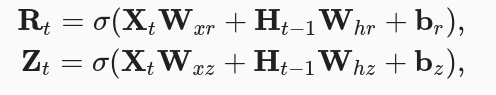

Next, we need to integrate the R with the regular latent state updating mechanism in RNN.

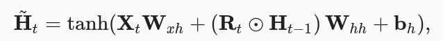

The result is a candidate since we still need to incorporate the action of the update gate.
The more close R to 1, we recover a vanilla RNN, and the more close R to 0 the candidate is closer to an MLP with Xt as input.

Finally, we need to incorporate the effect of Z. This determines how much to use from Ht-1 and the candidate.

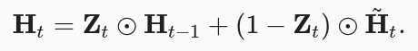

Whenever Z close to 1, we simply retain the old state (Xt is ignored). In contrast, whenever Z close to 0, the new latent Ht approaches the candidate state.

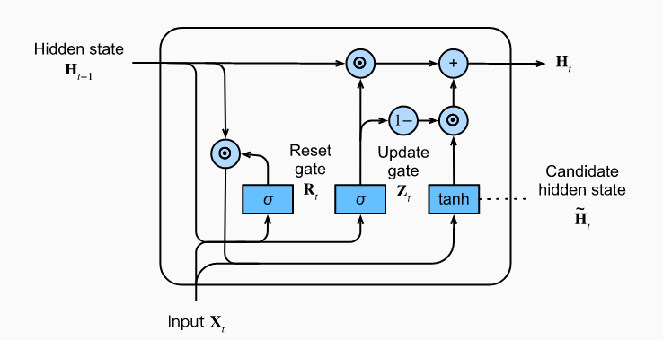

## 14.2 Long Short-Term Memory (LSTM)
LSTM introduces a memory cell (or cell for short) that has the same shape as the hidden state, engineered to record additional information.

To control the memory cell we need a number of gates.
* One gate is needed to read out the entries from the cell. We will refer to this as the output gate.
* A second gate is needed to decide when to read data into the cell. We refer to this as the input gate.
* Last, we need a mechanism to reset the content of the cell, governed by a forget gate.

Just like in GRUs, the data feeding into the LSTM gates are the input at the current time step and the hidden state of the previous time step. They are processed by three fully-connected layers with a sigmoid activation function to compute the values of the input, forget and output gates.

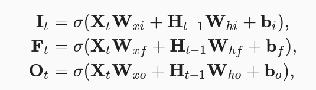

Next we design the memory cell. We first introduce the candidate memory cell.

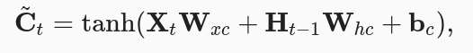

The input gate I governs how much we take new data into account via C~t and the forget gate F addresses how much of the old memory cell content Ct−1 we retain.

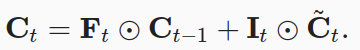

If the forget gate is 1 and the input gate is 0, the past memory cells Ct−1 will be saved over time and passed to the current time step. This design is introduced to alleviate the vanishing gradient problem and to better capture long range dependencies within sequences.

And finally, the hidden state:

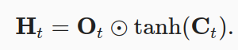

Whenever the output gate approximates 1 we effectively pass all memory information through to the predictor, whereas for the output gate close to 0 we retain all the information only within the memory cell and perform no further processing.

## 14.3 Deep RNN
We could stack multiple layers of RNNs on top of each other. This results in a flexible mechanism, due to the combination of several simple layers. In particular, data might be relevant at different levels of the stack. For instance, we might want to keep high-level data about financial market conditions (bear or bull market) available, whereas at a lower level we only record shorter-term temporal dynamics.

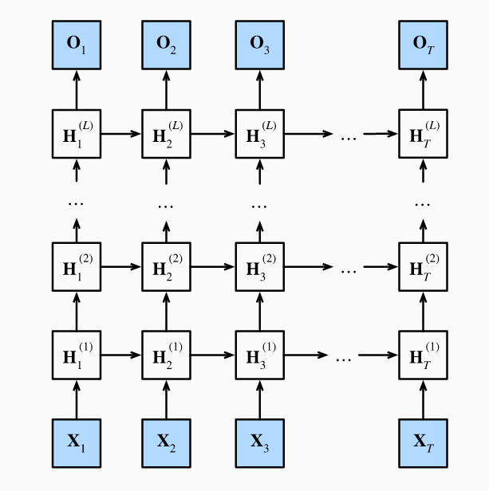

## 14.4 Bidirectional RNN

Instead of running an RNN only in the forward mode starting from the first token, we start another one from the last token running from back to front. Bidirectional RNNs add a hidden layer that passes information in a backward direction to more flexibly process such information

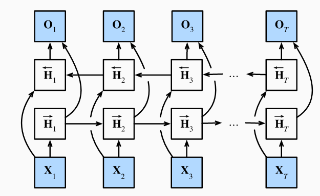

The forward and backward hidden state updates are as follows:

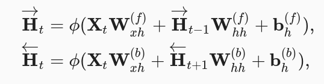

Next, we concatenate the forward and backward hidden states H→t and H←t to obtain the hidden state Ht (n×2h) to be fed into the output layer.

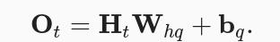

*Whq ∈ R2h×q*

Bidirectional RNNs are exceedingly slow. The main reasons for this are that the forward propagation requires both forward and backward recursions in bidirectional layers and that the backpropagation is dependent on the outcomes of the forward propagation. Hence, gradients will have a very long dependency chain.
