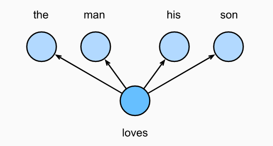
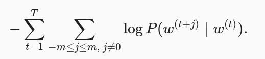
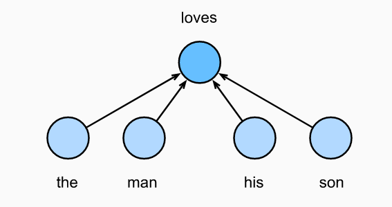
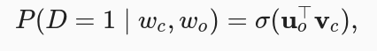
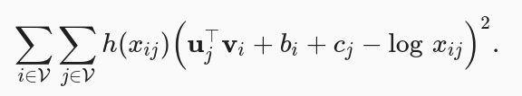

# 15. Embedding
A word vector is a vector used to represent a word. It can also be thought of as the feature vector of a word. The technique of mapping words to vectors of real numbers is also known as word embedding.

Why we not use one-hot word vectors:
- they cannot accurately express the similarity between different words, such as the cosine similarity that we commonly use.
- sparse matrix

## 15.1 word2vec
Word2vec is a tool that we came up with to solve the problem above. It represents each word with a fixed-length vector and uses these vectors to better indicate the similarity and analogy relationships between different words.

### 15.1.1 Skip-Gram model
The skip-gram model cares about the conditional probability of generating context words for a given central target word.

The conditional probability of generating the context word for the given central target word can be obtained by performing a softmax operation on the vector inner product:

The skip-gram model parameters are the central target word vector and context word vector for each individual word. In the training process, we are going to learn the model parameters by maximizing the likelihood function, which is also known as maximum likelihood estimation. This is equivalent to minimizing the following loss function:

### 15.1.2 Continuous Bag of Words (CBOW)

Since there are multiple context words in the CBOW model, we will average their word vectors and then use the same method as the skip-gram model to compute the conditional probability.

CBOW model training is quite similar to skip-gram model training. The maximum likelihood estimation of the CBOW model is equivalent to minimizing the loss function.

## 15.1.3 Negative sampling

For larger dictionaries with hundreds of thousands or even millions of words, the overhead for computing each gradient may be too high. In order to reduce such computational complexity.

Negative sampling modifies the original objective function. Given a context window for the central target word wc, we will treat it as an event for context word wo to appear in the context window and compute the probability of this event from.

## 15.3 GloVe
GloVe adopts squared loss and makes three changes to the skip-gram model based on this loss.

1. Here, we use the non-probability distribution variables p′ij=xij and q′ij=exp(u⊤jvi) and take their logs. Therefore, we get the squared loss.

2. We add two scalar model parameters for each word wi: the bias terms bi (for central target words) and ci (for context words).

3. Replace the weight of each loss with the function h(xij). The weight function h(x) is a monotone increasing function with the range [0,1].

## 15.4 fastText

FastText proposes a subword embedding method. Based on the skip-gram model in word2vec, it represents the central word vector as the sum of the subword vectors of the word.

Subword embedding utilizes the principles of morphology, which usually improves the quality of representations of uncommon words.

Byte pair encoding performs a statistical analysis of the training dataset to discover common symbols within a word. As a greedy approach, byte pair encoding iteratively merges the most frequent pair of consecutive symbols.
