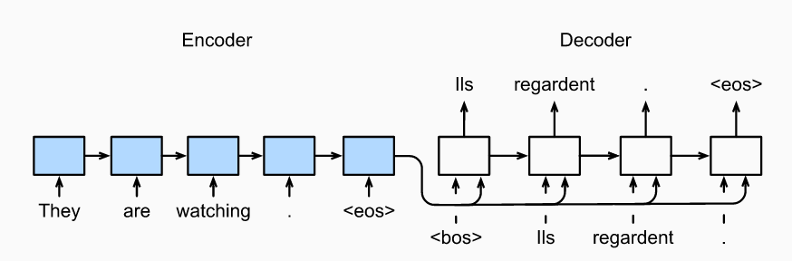
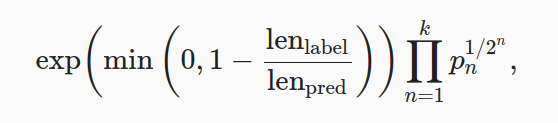
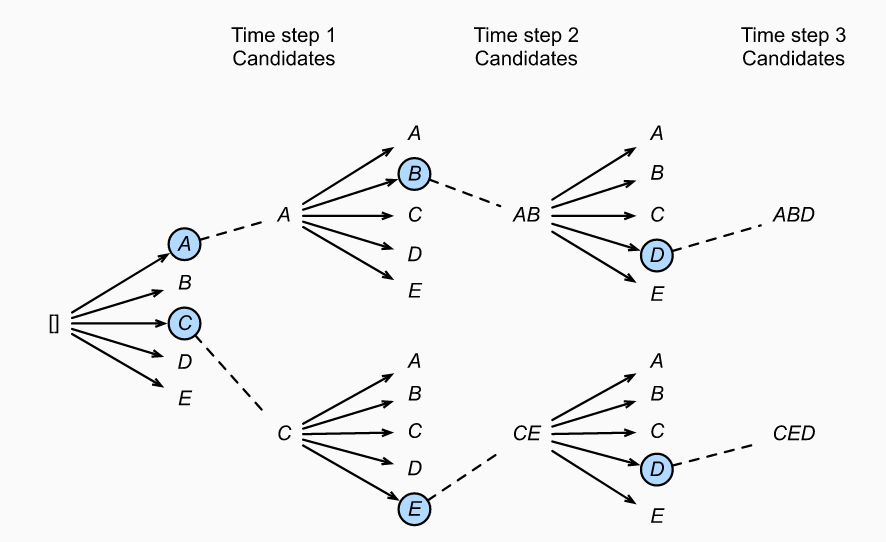

# 16. RNN applications

## 16.1 Machine Translation
Machine translation refers to the automatic translation of a sequence from one language to another.

To handle this type of inputs and outputs, we can design an architecture with two major components. The first component is an encoder: it takes a variable-length sequence as the input and transforms it into a state with a fixed shape. The second component is a decoder: it maps the encoded state of a fixed shape to a variable-length sequence.

## 16.2 Sequence to Sequence Learning
The RNN encoder can take a variable-length sequence as the input and transforms it into a fixed-shape hidden state. To generate the output sequence token by token, a separate RNN decoder can predict the next token based on what tokens have been seen (such as in language modeling) or generated, together with the encoded information of the input sequence.

### 16.2.1 Encoder
Technically speaking, the encoder transforms an input sequence of variable length into a fixed-shape context variable c, and encodes the input sequence information in this context variable. In the book example, the context variable is just the hidden state hT of the input sequence at the final time step.

## 16.2.2 Decoder
Given the output sequence y1,y2,…,yT′ from the training dataset, for each time step t′ (the symbol differs from the time step t of input sequences or encoders), the probability of the decoder output yt′ is conditional on the previous output subsequence y1,…,yt′−1 and the context variable c, i.e., P(yt′∣y1,…,yt′−1,c).

At any time step t′ on the output sequence, the RNN takes the output yt′−1 from the previous time step and the context variable c as its input, then transforms them and the previous hidden state st′−1 into the hidden state st′ at the current time step.

After obtaining the hidden state of the decoder, we can use an output layer and the softmax operation to compute the conditional probability distribution P(yt′∣y1,…,yt′−1,c) for the output at time step t′.

**Loss function:** prediction of padding tokens should be excluded from loss calculations.

## 16.2.3 BLEU

BLEU (Bilingual Evaluation Understudy), has been extensively used in measuring the quality of output sequences for different applications. In principle, for any n-grams in the predicted sequence, BLEU evaluates whether this n-grams appears in the label sequence.

Denote by pn the precision of n-grams, which is the ratio of the number of matched n-grams in the predicted and label sequences to the number of n-grams in the predicted sequence.

BLEU is defined as:

where k is the longest n-grams for matching.

## 16.2.4 Beam search

**Greedy Search:** In greedy search, at any time step t′ of the output sequence, we search for the token with the highest conditional probability from Y. Once “<eos>” is outputted or the output sequence has reached its maximum length T′, the output sequence is completed. Unfortunately, there is no guarantee that the optimal sequence will be obtained by greedy search.

**Exhaustive Search:** If the goal is to obtain the optimal sequence, we may consider using exhaustive search: exhaustively enumerate all the possible output sequences with their conditional probabilities, then output the one with the highest conditional probability. But this has a very high computational cost.

**Beam Search:** At time step 1, we select k tokens with the highest conditional probabilities. Each of them will be the first token of k candidate output sequences, respectively. At each subsequent time step, based on the k candidate output sequences at the previous time step, we continue to select k candidate output sequences with the highest conditional probabilities from k|Y| possible choices.

