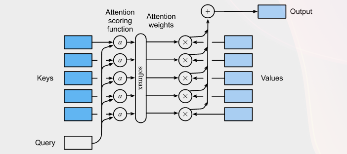
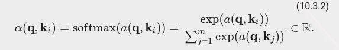
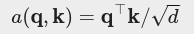
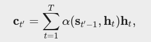
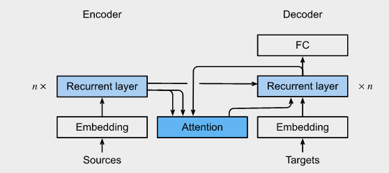
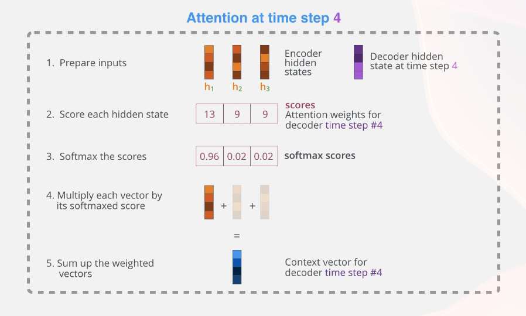
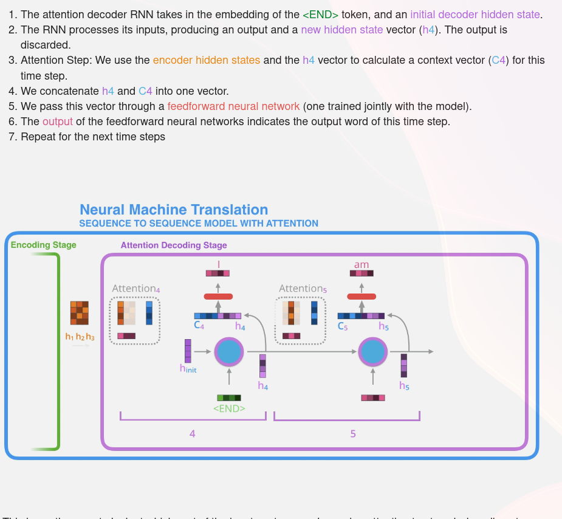

# 17. Attention

## 17.1 Queries, Keys, and Values

Mathematically, suppose that we have a query **q** ∈ Rq and **m** key-value pairs (k1,v1),…,(km,vm). The attention weights will be:

To ensure that the variance of the dot product still remains one regardless of vector length, the scaled dot-product attention scoring function divides the dot product by sqrt(d).

## 17.2 Bahdanau Attention

Suppose that there are T tokens in the input sequence, the context variable at the decoding time step t′ is the output of attention pooling:

where the decoder hidden state st′−1 at time step t′−1 is the query, and the encoder hidden states ht are both the keys and values.

## 17.3 Jalammar blog

A very intuitive approach to understand attention: https://jalammar.github.io/visualizing-neural-machine-translation-mechanics-of-seq2seq-models-with-attention/

