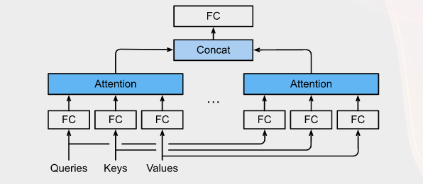
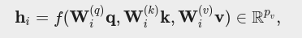
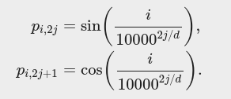
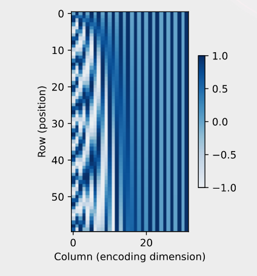

# 18. Multi-head and self attention

## 18.1 Multi-head attention

Instead of performing a single attention pooling, queries, keys, and values can be transformed with h independently learned linear projections. Then these h projected queries, keys, and values are fed into attention pooling in parallel. In the end, h attention pooling outputs are concatenated and transformed with another learned linear projection to produce the final output.

Given a query **q** ∈ Rdq, a key **k** ∈ Rdk, and a value **v** ∈ Rdv, each attention head hi is computed as:

where learnable parameters **W(q)i** ∈ Rpq×dq, **W(k)i** ∈ Rpk×dk and **W(v)i** ∈ Rpv×dv, and **f** is attention pooling, such as additive attention and scaled dot-product attention.

The multi-head attention output is another linear transformation via learnable parameters **Wo** ∈ Rpo×hpv of the concatenation of h heads.

## 18.2 Self-attention
If we feed a sequence of tokens into attention pooling so that the same set of tokens act as queries, keys, and values. Specifically, each query attends to all the key-value pairs and generates one attention output. Since the queries, keys, and values come from the same place, this performs self-attention which is also called intra-attention.

In self-attention, the queries, keys, and values are all n×d matrices. Consider the scaled dot-product attention, where a **n×d** matrix is multiplied by a **d×n** matrix, then the output **n×n** matrix is multiplied by a **n×d** matrix.

As a result, the self-attention has a **O(n2d)** computational complexity. Therefore, computation can be parallel with O(1) sequential operations and the maximum path length is also O(1).

## 18.3 Positional Encoding
To use the sequence order information, we can inject absolute or relative positional information by adding positional encoding to the input representations.

Suppose that the input representation **X** ∈ Rn×d contains the d-dimensional embeddings for n tokens of a sequence. The positional encoding outputs **X + P** using a positional embedding matrix **P** ∈ Rn×d of the same shape, whose element on the ith row and the (2j)th or the (2j+1)th column is:

**Absolute positional information:**  In binary representations, a higher bit has a lower frequency than a lower bit. Similarly, as demonstrated in the heat map below, the positional encoding decreases frequencies along the encoding dimension by using trigonometric functions. Since the outputs are float numbers, such continuous representations are more space-efficient than binary representations.

**Relative positional information:** Besides capturing absolute positional information, the above positional encoding also allows a model to easily learn to attend by relative positions. This is because for any fixed position offset δ, the positional encoding at position i+δ can be represented by a linear projection of that at position i.
