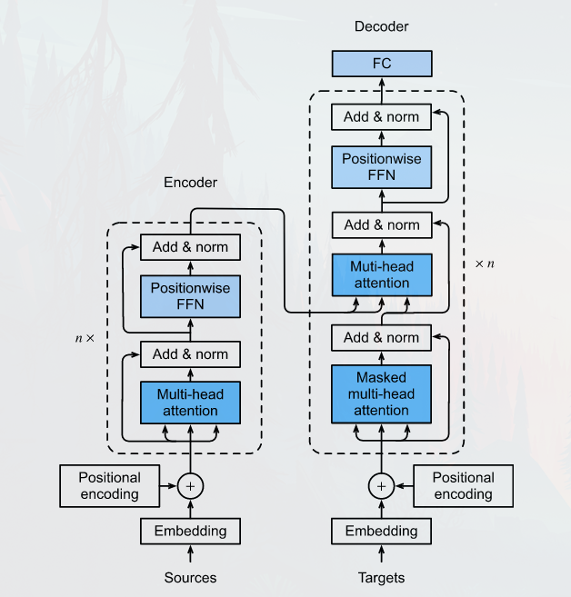

# 19. Transformer

#### Encoder:
- Stack of multiple identical layers, where each layer has two sublayers.

- The first layer is a multi-head self-attention pooling and the second is a positionwise feed-forward network.

- In the encoder self-attention, queries, keys, and values are all from the the outputs of the previous encoder layer.

- A residual connection followed by layer normalization is employed around both sublayers. As a result, the transformer encoder outputs a **d-dimensional** vector representation for each position of the input sequence.

#### Decoder:

- Stack of multiple identical layers with residual connections and layer normalizations.

- The decoder inserts a third sublayer, known as the encoder-decoder attention, between these two. In the encoder-decoder attention, queries are from the outputs of the previous decoder layer, and the keys and values are from the transformer encoder outputs.

- In the decoder self-attention, queries, keys, and values are all from the the outputs of the previous decoder layer. However, each position in the decoder is allowed to only attend to all positions in the decoder up to that position. This masked attention preserves the auto-regressive property, ensuring that the prediction only depends on those output tokens that have been generated.

#### Comments:
- **Positionwise FFN:** The same MLP transforms at all the positions, when the inputs at all these positions are the same, their outputs are also identical.

- **Residual connection and Layer norm:** layer normalization is the same as batch normalization except that the former normalizes across the feature dimension.

- **Masked multi-head decoder self-attention:** When training sequence-to-sequence models, tokens at all the positions (time steps) of the output sequence are known. However, during prediction the output sequence is generated token by token; thus, at any decoder time step only the generated tokens can be used in the decoder self-attention. To preserve auto-regression in the decoder, there is a masked self-attention so that any query only attends to all positions in the decoder up to the query position.
