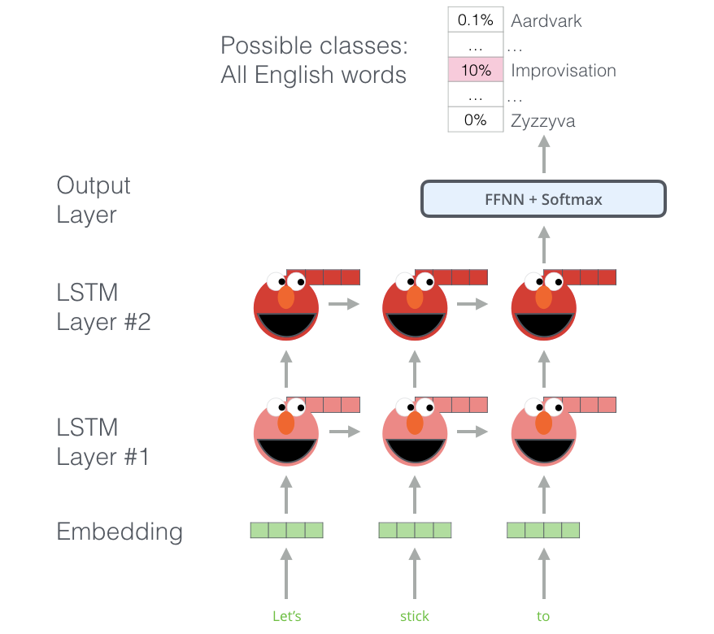
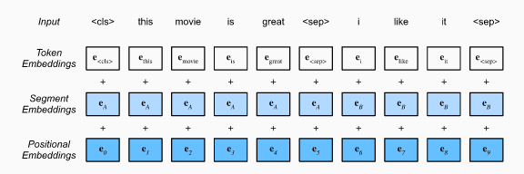

# 20. Bidirectional Encoder Representations from Transformers (BERT)

## ELMo
Motivated by the development of context-sensitive word representations, where representations of words depend on their contexts. Hence, a context-sensitive representation of token x is a function f(x,c(x)) depending on both x and its context c(x). 

ELMo is a function that assigns a representation to each word from the input sequence. Specifically, ELMo combines all the intermediate layer representations from pretrained bidirectional LSTM as the output representation. Then the ELMo representation will be added to a downstream task’s existing supervised model as additional features, such as by concatenating ELMo representation and the original representation (e.g., GloVe) of tokens in the existing model.

ELMo gained its language understanding from being trained to predict the next word in a sequence of words - a task called Language Modeling. This is convenient because we have vast amounts of text data that such a model can learn from without needing labels.

## GPT
The GPT (Generative Pre-Training) model represents an effort in designing a general task-agnostic model for context-sensitive representations. Built on a transformer decoder, GPT pretrains a language model that will be used to represent text sequences. When applying GPT to a downstream task, the output of the language model will be fed into an added linear output layer to predict the label of the task. In sharp contrast to ELMo that freezes parameters of the pretrained model, GPT fine-tunes all the parameters in the pretrained transformer decoder during supervised learning of the downstream task. GPT was evaluated on twelve tasks of natural language inference, question answering, sentence similarity, and classification, and improved the state of the art in nine of them with minimal changes to the model architecture.

However, due to the autoregressive nature of language models, GPT only looks forward (left-to-right)

## BERT (Combining the best of both worlds)
BERT (Bidirectional Encoder Representations from Transformers) encodes context bidirectionally and requires minimal architecture changes for a wide range of natural language processing tasks.

#### Input representation
The BERT input sequence unambiguously represents both single text and text pairs. In the former, the BERT input sequence is the concatenation of the special classification token “<cls>”, tokens of a text sequence, and the special separation token “<sep>”. In the latter, the BERT input sequence is the concatenation of “<cls>”, tokens of the first text sequence, “<sep>”, tokens of the second text sequence, and “<sep>”.

To distinguish text pairs, the learned segment embeddings eA and eB are added to the token embeddings of the first sequence and the second sequence, respectively. For single text inputs, only eA is used.

Common in the transformer encoder, positional embeddings are added at every position of the BERT input sequence. However, different from the original transformer encoder, BERT uses learnable positional embeddings.

#### Pretraining tasks

* **Masked Language Modeling:** In this pretraining task, 15% of tokens will be selected at random as the masked tokens for prediction. To predict a masked token without cheating by using the label, one straightforward approach is to always replace it with a special “<mask>” token in the BERT input sequence. However, the artificial special token “<mask>” will never appear in fine-tuning. To avoid such a mismatch between pretraining and fine-tuning, if a token is masked for prediction (e.g., “great” is selected to be masked and predicted in “this movie is great”), in the input it will be replaced with:
  *  <mask> for 80% of the time (this movie is <mask>)
  * random token for 10% of the time (this movie is drink)
  * unchanged label token for 10% of the time (this movie is great)

* **Next sentence prediction:** To help understand the relationship between two text sequences, BERT considers a binary classification task, next sentence prediction, in its pretraining. When generating sentence pairs for pretraining, for half of the time they are indeed consecutive sentences with the label “True”; while for the other half of the time the second sentence is randomly sampled from the corpus with the label “False”.

*The original BERT has been pretrained on the concatenation of BookCorpus and English Wikipedia. These two text corpora are huge: they have 800 million words and 2.5 billion words, respectively.*

When pretraining BERT, the final loss function is a linear combination of both the loss functions for masked language modeling and next sentence prediction. 
