# 21. Recommender Systems

## 21.1 Matrix Factorization
The model factorizes the user-item interaction matrix (e.g., rating matrix) into the product of two lower-rank matrices, capturing the low-rank structure of the user-item interactions.

- Let **R ∈ Rm×n** denote the interaction matrix with **m** users and **n** items, and the values of **R** represent explicit ratings.

- The user-item interaction will be factorized into a user latent matrix **P ∈ Rm×k** and an item latent matrix **Q ∈ Rn×k**, where k≪m,n, is the latent factor size.

- Let **pu** denote the uth row of **P** and **qi** denote the ith row of **Q**. For a given item i, the elements of **qi** measure the extent to which the item possesses those characteristics such as the genres and languages of a movie. For a given user u, the elements of **pu** measure the extent of interest the user has in items’ corresponding characteristics. These latent factors might measure obvious dimensions as mentioned in those examples or are completely uninterpretable.

The predicted ratings can be estimated by: **R = PQ^T**

One major problem of this prediction rule is that users/items biases can not be modeled. For example, some users tend to give higher ratings or some items always get lower ratings due to poorer quality. These biases are commonplace in real-world applications. To capture these biases, user specific and item specific bias terms are introduced. Specifically, the predicted rating user u gives to item i is calculated by:

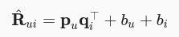

Then, we train the matrix factorization model by minimizing the mean squared error between predicted rating scores and real rating scores. The objective function is defined as follows:

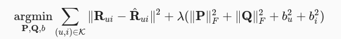

## 21.2 AutoRec: Rating Prediction with Autoencoders
In AutoRec, instead of explicitly embedding users/items into low-dimensional space, it uses the column/row of the interaction matrix as the input, then reconstructs the interaction matrix in the output layer.

AutoRec focuses on learning/reconstructing the output layer. It uses a partially observed interaction matrix as the input, aiming to reconstruct a completed rating matrix. In the meantime, the missing entries of the input are filled in the output layer via reconstruction for the purpose of recommendation.

**Item based AutoRec:**
Let **R∗i** denote the ith column of the rating matrix, where unknown ratings are set to zeros by default. The neural architecture is defined as:

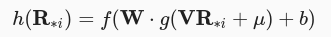

where **f(⋅)** and **g(⋅)** represent activation functions, **W** and **V** are weight matrices, **μ** and **b** are biases. Let **h(⋅)** denote the whole network of AutoRec. The output **h(R∗i)** is the reconstruction of the ith column of the rating matrix.

The following objective function aims to minimize the reconstruction error:

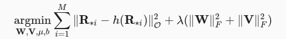

where **∥⋅∥O** means only the contribution of observed ratings are considered, that is, only weights that are associated with observed inputs are updated during back-propagation.

## 21.3 Personalized Ranking for Recommender Systems

Bayesian personalized ranking (BPR) has been widely used in many existing recommendation models. The training data of BPR consists of both positive and negative pairs (missing values). It assumes that the user prefers the positive item over all other non-observed items.

In formal, the training data is constructed by tuples in the form of (u,i,j), which represents that the user u prefers the item i over the item j.

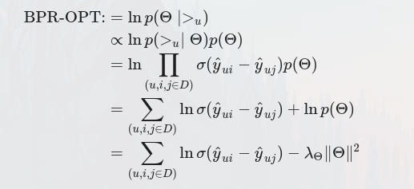

yui and yuj are the predicted scores of the user u to item i and j, respectively.

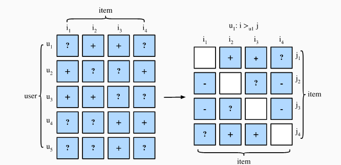

Also we can use the Hinge Loss, where m is the safety margin size. It aims to push negative items away from positive items.

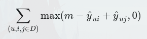

## 21.4 The NeuMF model

NeuMF fuses two subnetworks. The GMF is a generic neural network version of matrix factorization where the input is the elementwise product of user and item latent factors. It consists of two neural layers:

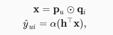

where ⊙ denotes the Hadamard product of vectors. P∈Rm×k and Q∈Rn×k corespond to user and item latent matrix respectively. pu∈Rk is the uth row of P and qi∈Rk is the ith row of Q. α and h denote the activation function and weight of the output layer. y^ui is the prediction score of the user u might give to the item i.

Another component of this model is MLP. To enrich model flexibility, the MLP subnetwork does not share user and item embeddings with GMF. It uses the concatenation of user and item embeddings as input.

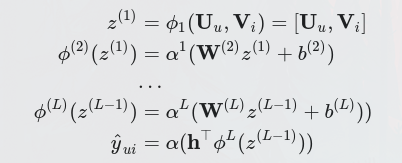

To fuse the results of GMF and MLP, instead of simple addition, NeuMF concatenates the second last layers of two subnetworks to create a feature vector which can be passed to the further layers.

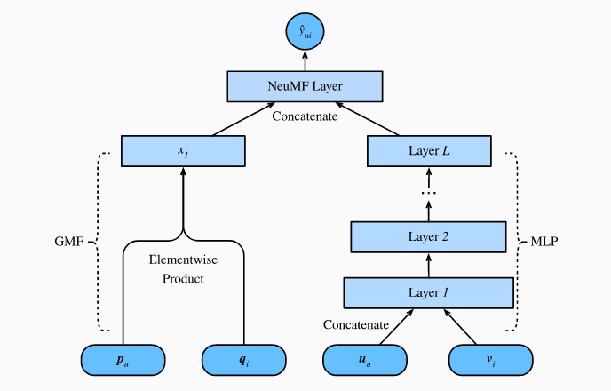

## 21.5 Sequence-Aware Recommender Systems

In sequence-aware recommendation system, each user is associated with a sequence of some items from the item set. Let Su=(Su1,...Su|Su|) denotes the ordered sequence. The goal of Caser is to recommend item by considering user general tastes as well as short-term intention.

 Suppose we take the previous L items into consideration, an embedding matrix that represents the former interactions for time step t can be constructed:

 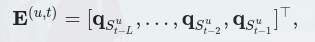

 We can view the input matrix E(u,t) as an image which is the input of the subsequent two convolutional components.

 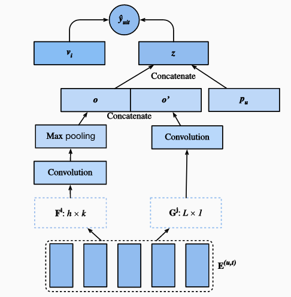
