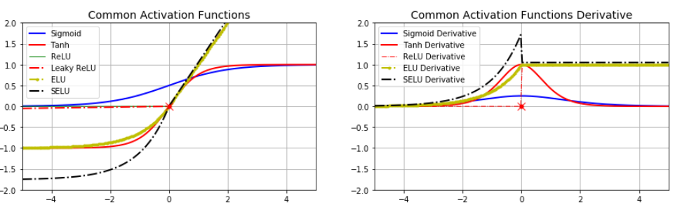
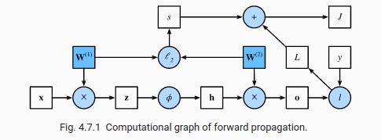

# 1. Multilayer Perceptrons

## 1.1 Hidden layers
We can overcome the limitations of linear models and handle a more general class of functions by incorporating one or more hidden layers. The easiest way to do this is to stack many fully-connected layers on top of each other.

The hidden units are given by an affine function of the inputs, and the outputs (pre-softmax) are just an affine function of the hidden units. An affine function of an affine function is itself an affine function.

In order to realize the potential of multilayer architectures, we need one more key ingredient: a nonlinear activation function σ to be applied to each hidden unit following the affine transformation. The outputs of activation functions (e.g., σ(⋅)) are called activations.

For certain choices of the activation function, it is widely known that MLPs are universal approximators. Even with a single-hidden-layer network, given enough nodes (possibly absurdly many), and the right set of weights, we can model any function, though actually learning that function is the hard part.

## 1.2 Activation functions

Activation functions decide whether a neuron should be activated or not by calculating the weighted sum and further adding bias with it. They are differentiable operators to transform input signals to outputs, while most of them add non-linearity.

**ReLu:** rectified linear unit, only retains positive elements and discards all negative elements by setting the corresponding activations to 0. When the input is negative, the derivative of the ReLU function is 0, and when the input is positive, the derivative of the ReLU function is 1.

**Sigmoid:** transforms its inputs, for which values lie in the domain R, to outputs that lie on the interval (0, 1). The derivative of the sigmoid function reaches a maximum of 0.25. As the input diverges from 0 in either direction, the derivative approaches 0.

**Tanh:** similar to sigmoid but the outputs lies on the interval (-1, 1) and the derivative reaches a maximum of 1.

## 1.3 Forward Propagation, Backward Propagation, and Computational Graphs

Forward propagation (or forward pass) refers to the calculation and storage of intermediate variables (including outputs) for a neural network in order from the input layer to the output layer.

Plotting computational graphs helps us visualize the dependencies of operators and variables within the calculation.

Backpropagation refers to the method of calculating the gradient of neural network parameters. In short, the method traverses the network in reverse order, from the output to the input layer, according to the chain rule from calculus. The algorithm stores any intermediate variables (partial derivatives) required while calculating the gradient with respect to some parameters.

When training neural networks, forward and backward propagation depend on each other. In particular, for forward propagation, we traverse the computational graph in the direction of dependencies and compute all the variables on its path. These are then used for backpropagation where the compute order on the graph is reversed.

## 1.4 Numerical Stability and Initialization

One frequent culprit causing the **vanishing gradient** problem is the choice of the activation function σ that is appended following each layer’s linear operations. The sigmoid’s gradient vanishes both when its inputs are large and when they are small. Consequently, ReLUs, which are more stable (but less neurally plausible), have emerged as the default choice for practitioners.

The opposite problem, when **gradients explode**, can be similarly vexing.  When this happens due to the initialization of a deep network, we have no chance of getting a gradient descent optimizer to converge.

**Symmetry:** if we initialized all of the parameters of the hidden layer as W(1)=c for some constant c. In this case, during forward propagation either hidden unit takes the same inputs and parameters, producing the same activation, which is fed to the output unit. During backpropagation, differentiating the output unit with respect to parameters W(1) gives a gradient whose elements all take the same value. Thus, after gradient-based iteration, all the elements of W(1) still take the same value. Such iterations would never break the symmetry on its own and we might never be able to realize the network’s expressive power.

**Parameters initialization:**
- Default: normal distribution
- Xavier: samples weights from a Gaussian distribution with zero mean and variance σ2=2/(n_in+n_out)

A deep learning framework often implements over a dozen different heuristics. Moreover, parameter initialization continues to be a hot area of fundamental research in deep learning.
