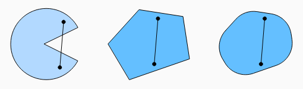
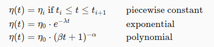
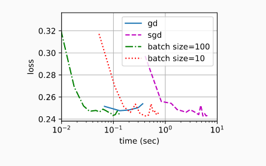

# 6. Optimization

## 6.1 Optimization and deep learning
In this chapter, we are going to focus specifically on the performance of the optimization algorithm in minimizing the objective function. In deep learning, most objective functions are complicated and do not have analytical solutions. Instead, we must use numerical optimization algorithms.

**Challenges:**
#### Local Minima:

#### Saddle Points:

Eigenvalues of the function’s Hessian matrix at the zero-gradient position  are
1. (+) -> Local minimum
2. (-) -> Local maximum
3. (+) and (-) -> Saddle point

Convex functions are those where the eigenvalues of the Hessian are never negative. Sadly, though, most deep learning problems do not fall into this category.

#### Vanishing gradients:

For larger values of x in tanh(x), the gradient is close to nill. Optimization will get stuck for a long time before we make progress. This turns out to be one of the reasons that training deep learning models was quite tricky prior to the introduction of the ReLU activation function.

### 6.2 Convexity:
Even though the optimization problems in deep learning are generally nonconvex, they often exhibit some properties of convex ones near local minima.

**Sets:**  a set is convex if for any a,b in set, the line connecting a and b is also in the set. If X and Y are convex, the union is also convex.

**Convex functions:** The requiremnt that X is a convex set is necessary.

## 6.3 Gradient Descent
### 6.3.1 One dimension

x ← (x − ηf′(x))

The value of function f(x) might decline. Therefore, in gradient descent we first choose an initial value x and a constant η>0 and then use them to continuously iterate x until the stop condition is reached, for example, when the magnitude of the gradient |f′(x)| is small enough or the number of iterations has reached a certain value.

#### Learning rate
If we use a learning rate that is too small, it will cause x to update very slowly, requiring more iterations to get a better solution.

#### Local Minima
Depending on our choice of learning rate and depending on how well conditioned the problem is, we may end up with one of many solutions.

### 6.3.2 Multivariate Gradient Descent
Let us consider the situation where x ∈ Rd. That is, the objective function f : Rd → R maps vectors into scalars. Its gradient is a vector consisting of d partial derivatives.

## 6.4 Stochastic Gradient Descent
Stochastic gradient descent (SGD) reduces computational cost at each iteration. At each iteration of stochastic gradient descent, we uniformly sample an index for data examples at random, and compute the gradient to update x.

As we can see, the trajectory of the variables in the SGD is much more noisy than the one we observed in gradient descent. This is due to the stochastic nature of the gradient.

**Dynamic Learning Rate:** Replacing η with a time-dependent learning rate η(t).

## 6.5 Minibatch Stochastic Gradient Descent
Gradient Descent is not particularly data efficient whenever data is very similar. Stochastic Gradient Descent is not particularly computationally efficient since CPUs and GPUs cannot exploit the full power of vectorization

We can increase the computational efficiency of this operation by applying it to a minibatch of observations at a time. That is, we replace the gradient over a single observation by one over a small batch

Now we can compare the time vs. loss for the previous four experiments. As can be seen, although SGD converges faster than GD in terms of number of examples processed, it uses more time to reach the same loss than GD because computing the gradient example by example is not as efficient. Minibatch SGD is able to trade-off convergence speed and computation efficiency. A minibatch size of 10 is more efficient than SGD; a minibatch size of 100 even outperforms GD in terms of runtime.

## 6.6 Momentum

v is called momentum. It accumulates past gradients similar to how a heavy ball rolling down the objective function landscape integrates over past forces. Large β amounts to a long-range average, whereas small β amounts to only a slight correction relative to a gradient method.
