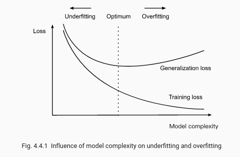
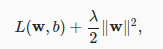
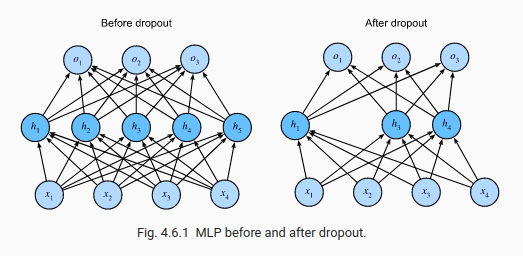

# 7. Model selection

## 7.1 Model Selection, Underfitting, and Overfitting
The phenomenon of fitting our training data more closely than we fit the underlying distribution is called overfitting, and the techniques used to combat overfitting are called regularization.

The **training error** is the error of our model as calculated on the training dataset, while **generalization error** is the expectation of our model’s error were we to apply it to an infinite stream of additional data examples drawn from the same underlying data distribution as our original sample.

In practice, we must estimate the generalization error by applying our model to an independent test set constituted of a random selection of data examples that were withheld from our training set.

* we assume that both the training data and the test data are drawn independently from identical distributions.

**Validation dataset:** In principle we should not touch our test set until after we have chosen all our hyperparameters. Were we to use the test data in the model selection process, there is a risk that we might overfit the test data. The common practice to address this problem is to split our data three ways, incorporating a validation dataset (or validation set) in addition to the training and test datasets.

## 7.2 Weight decay

The most common method for ensuring a small weight vector is to add its norm as a penalty term to the problem of minimizing the loss. Thus we replace our original objective, minimizing the prediction loss on the training labels, with new objective, minimizing the sum of the prediction loss and the penalty term. Now, if our weight vector grows too large, our learning algorithm might focus on minimizing the weight norm ∥w∥2 vs. minimizing the training error.

## 7.3 Dropout

When we apply dropout to a hidden layer, zeroing out each hidden unit with probability p, the result can be viewed as a network containing only a subset of the original neurons. In the fig, h2 and h5 are removed. Consequently, the calculation of the outputs no longer depends on h2 or h5 and their respective gradient also vanishes when performing backpropagation. In this way, the calculation of the output layer cannot be overly dependent on any one element of h1,…,h5.

