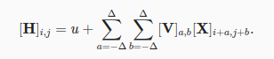
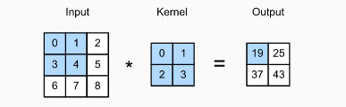
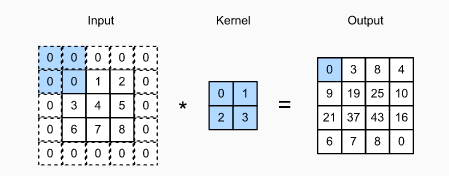
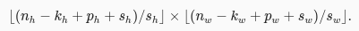
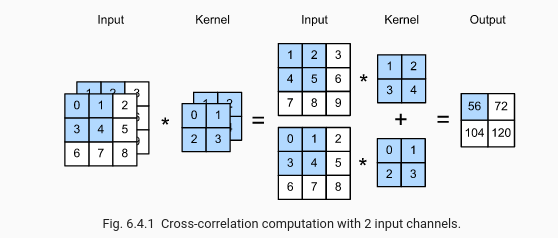
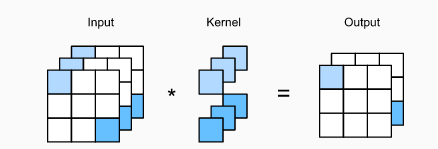
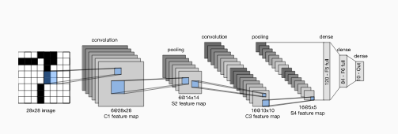

# 8. Convolutional Neural Networks

## 8.1 From FC to Convolutions

- **Translation invariance:** In the earliest layers, our network should respond similarly to the same patch, regardless of where it appears in the image.

  This implies that a shift in the input X should simply lead to a shift in the hidden representation H. This is only possible if V and U do not actually depend on (i,j)

- **Locality principle**: The earliest layers of the network should focus on local regions, without regard for the contents of the image in distant regions

  We should not have to look very far away from location (i,j) in order to glean relevant information to assess what is going on at [H]i,j.

Convolutional neural networks (CNNs) are a special family of neural networks that contain convolutional layers. In the deep learning research community, V is referred to as a convolution kernel, a filter, or simply the layer’s weights that are often learnable parameters.

## 8.2 Convolutions for Images

**The Cross-Correlation Operation**:

Note that along each axis, the output size is slightly smaller than the input size.

Output size = (n_h - k_h + 1) x (n_w - k_w + 1)

The convolutional layer output is sometimes called a feature map, as it can be regarded as the learned representations (features) in the spatial dimensions (e.g., width and height) to the subsequent layer.

**Conv layer:** A convolutional layer cross-correlates the input and kernel and adds a scalar bias to produce an output. The two parameters of a convolutional layer are the kernel and the scalar bias. When training models based on convolutional layers, we typically initialize the kernels randomly, just as we would with a fully-connected layer.

## 8.3 Padding and stride

**Padding:** one tricky issue when applying convolutional layers is that we tend to lose pixels on the perimeter of our image. One straightforward solution to this problem is to add extra pixels of filler around the boundary of our input image.

Output size = (n_h - k_h + p_h + 1) x (n_w - k_w + p_w + 1)

In many cases, we will want to set: *p_h = k_h - 1* to give the input and output the same height and width.

**Stride:** we refer to the number of rows and columns traversed per slide as the stride. The stride can reduce the resolution of the output, for example reducing the height and width of the output to only 1/n of the height and width of the input (n is an integer greater than 1).

So, putting it all together, our output will be:

## 8.4 Multiple input and Multiple Output channels

**Multiple inputs:** when channels > 1, we need a kernel that contains a tensor of shape kh × kw for every input channel. Concatenating these ci tensors together yields a convolution kernel of shape ci × kh × kw. Since the input and convolution kernel each have ci channels, we can perform a cross-correlation operation on the two-dimensional tensor of the input and the two-dimensional tensor of the convolution kernel for each channel, adding the ci results together (summing over the channels) to yield a two-dimensional tensor. This is the result of a two-dimensional cross-correlation between a multi-channel input and a multi-input-channel convolution kernel.

**Multiple outputs:** Denote by ci and co the number of input and output channels, respectively, and let kh and kw be the height and width of the kernel. To get an output with multiple channels, we can create a kernel tensor of shape ci×kh×kw for every output channel. We concatenate them on the output channel dimension, so that the shape of the convolution kernel is co×ci×kh×kw.

**1x1 Conv layer:** You could think of it as constituting a fully-connected layer applied at every single pixel location to transform the ci corresponding input values into co output values.

Is typically used to adjust the number of channels between network layers and to control model complexity.

## 8.5 Pooling

Often, as we process images, we want to gradually reduce the spatial resolution of our hidden representations, aggregating information so that the higher up we go in the network, the larger the receptive field (in the input) to which each hidden node is sensitive.

Pooling operators consist of a fixed-shape window that is slid over all regions in the input according to its stride, computing a single output for each location traversed by the fixed-shape window (sometimes known as the pooling window).

However, unlike the cross-correlation computation of the inputs and kernels in the convolutional layer, the pooling layer contains no parameters (there is no kernel).

In both cases (MAX, AVG), as with the cross-correlation operator, we can think of the pooling window as starting from the top left of the input tensor and sliding across the input tensor from left to right and top to bottom. At each location that the pooling window hits, it computes the maximum or average value of the input subtensor in the window, depending on whether max or average pooling is employed.

**Output dimensions:** As with convolutional layers, pooling layers can also change the output shape. And as before, we can alter the operation to achieve a desired output shape by padding the input and adjusting the stride.

**Multiple channels:** When processing multi-channel input data, the pooling layer pools each input channel separately, rather than summing the inputs up over channels as in a convolutional layer.

## 8.6 LeNet
The first published CNNs to capture wide attention for its performance on computer vision tasks.

The basic units in each convolutional block are a convolutional layer, a sigmoid activation function, and a subsequent average pooling operation. Note that while ReLUs and max-pooling work better, these discoveries had not yet been made in the 1990s.

* Each **convolutional layer** uses a 5×5 kernel and a sigmoid activation function.
   * the first layer has 6 output channels
   * the second has 16.

* Each 2×2 **pooling operation** (stride 2) reduces dimensionality by a factor of 4 via spatial downsampling.

In order to pass output from the convolutional block to the dense block, we must flatten each example in the minibatch. In other words, we take this four-dimensional input and transform it into the two-dimensional input expected by fully-connected layers

LeNet’s dense block has three fully-connected layers, with 120, 84, and 10 outputs, respectively.
