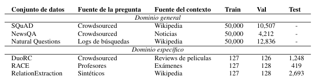
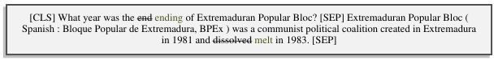
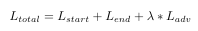
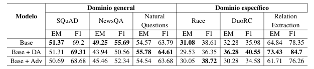

# Introducción

El punto de partida del proyecto fue el modelo base DistilBert,
propuesto en el [proyecto
final](http://web.stanford.edu/class/cs224n/project/default-final-project-handout-robustqa-track.pdf)
de la universidad de Stanford. A partir de una pregunta y un contexto
(fragmento de texto donde puede o no encontrarse la respuesta) dado, el
modelo deberá predecir la posición de la respuesta dentro del contexto.

El objetivo del proyecto es mejorar la performance del modelo base, por
lo que se decidió implementar algunas mejoras, como aumento de datos
(\"data augmentation\") sobre los datasets de dominio especifíco y luego
realizar un entrenamiento adversario a fin de crear un sistema QA más
generalista y robusto. Para la validación y evaluación de los modelos,
se utilizaron las métricas Exact Match (EM) y F1.

# Datasets

Según lo propuesto por el proyecto, se entrenaron, validaron y testearon
con los siguientes datasets:

Como muestra la tabla, los datasets de conocimiento general conforman la
mayor parte del conjunto de entrenamiento, mientras que las de
conocimiento específico, se encuentran en su mayor parte en el conjunto
de testeo. Esto supone un desafío para el modelo entrenado, ya que se
espera un sobre ajuste sobre el conjunto de entrenamiento, y un mal
desempeño en los conjuntos de dominio específico debido a su poca
aparición en el entrenamiento.

Para el preprocesado de los datasets, no se realizó ninguna limpieza de
caracteres especiales ni \"stop words\", y simplemente se tomaron las
preguntas, respuestas y contexto de cada ejemplo de los datasets
propuestos.

Luego, con la ayuda de la librería `transformers` de huggingface, se
tokenizaron los ejemplos (contexto - preguntas - respuestas) para luego
apendar los índices que correspondían a los tokens de comienzo y fin de
respuesta.

El modelo DistilBert, acepta como máximo 512 tokens de entrada. En este
proyecto, se crearon fragmentos de 384 tokens con un stride de 128, para
el caso de ejemplos donde la cantidad de tokens de la pregunta más el
contexto era mayor a 384. En caso de de que esta cantidad fuera menor a
384, se les apendó tokens de relleno hasta completar esta dimensión.

El input para el modelo consiste en la concatenación de los siguientes
tokens:

# Entrenamiento de modelo base

Para obtener un modelo base, se utilizó el modelo pre-entrenado
`distilbert-base-cased` de la librería `transformers` (un modelo mucho
mas rápido y liviano que BERT original) junto con dos capas lineales,
una para predecir el índice del token de comienzo y otra para el índice
del token de fin de respuesta.

La funcion de pérdida fue la suma de dos entropías cruzadas (una para
cada salida de las capas lineales) y un optimizador AdamW con una tasa
de aprendizaje de 3e^-5. Este modelo base se entrenó por 3 épocas,
con una duración total de alrededor de 11 horas.

# Data augmentation

Considerando la poca cantidad de ejemplos en los datasets de
conocimiento específico, y observando las mejoras en el desempeño de los
modelos obtenidas a través de técnicas de aumento de datos presentadas
en diferentes estudios, se decidió realizar este procedimiento sobre los
datasets de conocimiento específico.

Por cada ejemplo presente en el dataset original, se crearon 16 ejemplos
aumentados donde se reemplazó el 12% de las palabras presentes en la
pregunta y contexto original (de manera de no modificar la posición ni
las palabras de la respuesta), por sinónimos (con una probabilidad del
70%) y en otros casos simplemente se eliminaron las palabras (con una
probabilidad del 30%).

En cualquiera de los casos, las palabras \"stop words\" son exceptuadas
de este tipo de transformaciones, para evitar un cambio en el
significado de la pregunta o del contexto.

Para realizar estas transformaciones se utilizó la libreria `nlpaug`.
Aquí se muestra un ejemplo donde se realizó un cambio de palabras por
sinónimos.

El modelo se entreno por 3 épocas, con los mismos hiper parámetros que
el modelo base. La duración del entrenamiento fue similar al modelo
base.

# Entrenamiento adversario

Con el propósito de lograr un modelo agnóstico a características
específicas de dominio, se decidió implementar un entrenamiento
adversario. Para ello, se creó un nuevo modelo discriminador, conformado
por 3 capas lineales con activación ReLU, el cual recibe como entrada el
token `[CLS]` del modelo base (DistilBert). Con este input el
discriminador debe predecir a qué dominio (dataset) pertenece el
ejemplo.

Por lo tanto ahora el modelo base, además de ajustar sus parámetros para
encontrar los índices de los tokens de inicio y fin de la respuesta,
deberá también ajustarlos para intentar engañar al discriminador y
dificultar su tarea de clasificar el dominio del ejemplo, logrando
identificar características independientes del dominio y volviéndose más
generalista en el proceso de predicción.

Ahora, a la función de pérdida del modelo base, que consistía en dos
entropías cruzadas, una para la capa lineal de comienzo y otra para la
capa lineal de fin de respuesta, se le suma el componente
correspondiente a este entrenamiento adversario para obtener la pérdida
total. Para esta pérdida se utilizó la medida de divergencia de
Kullback-Leibler, la cual compara una distribución uniforme con las
predicciones del discriminador.

Donde lambda es una constante la cual indica que tanta importancia le
damos al entrenamiento adversario. Según \[referencia\], el valor óptimo
para este tipo de entrenamientos y arquitecturas es de lambda = 0.01.

Para el caso del discriminador se utilizó la pérdida de verosimilitud
negativa logarítmica (NLL), la cual compara una distribución
probabilística generada por el discriminador, con el índice de la clase
correcta.

Se entrenaron la misma cantidad de epochs que para el modelo base y
tanto el discriminador como el modelo base usaron un optimizador
`AdamW`. El discriminador se entrenó con un lr=5e^-5, mientras que
el modelo base usó los mismos hiper parámetros mencionados
anteriormente.

# Resultados

En la siguiente tabla, se muestra un resumen de las métricas de
evaluación obtenidas para cada conjunto de datos de **validación** y
cada modelo descripto anteriormente.

El aumento de datos en los datasets de dominio específico trajo un
aumento promedio **+2.41%** en el EM y un **+1.29%** del F1, no solo
mejoró las métricas de los datasets aumentados, si no tambien, de
algunos de dominio general.

El primer entrenamiento adversario, arrojó una disminución promedio de
**-3.76%** en EM y un **-2.14%** del F1, esto puede ser el resultado de
un entrenamiento inestable y en el cual no se le presto atención a los
hiper parámetros.

# Conclusiones

Como primera conclusión, se pudo observar la importancia que juega la
cantidad de datos disponibles, mostrando que podemos mejorar los modelos
en este tipo de situaciones, creando ejemplos sintéticos a partir de los
originales. Como segunda conclusión, aún obteniendo resultados que no
superan el modelo base, creemos que este tipo de entrenamientos ayuda a
aprender características independientes del dominio (de hecho varios
trabajos lo demuestran), pero, se debe prestar mucha atención a la hora
de seleccionar hiper parámetros y de la implementación de este tipo de
entrenamientos, ya que suelen ser muy inestables y requieren de
condiciones muy especiales para que puedan funcionar correctamente. De
hecho, se ha visto el mismo tipo de comportamiento en otros trabajos en
donde la performance del modelo mejora para ciertos datasets pero
empeora para otros.
